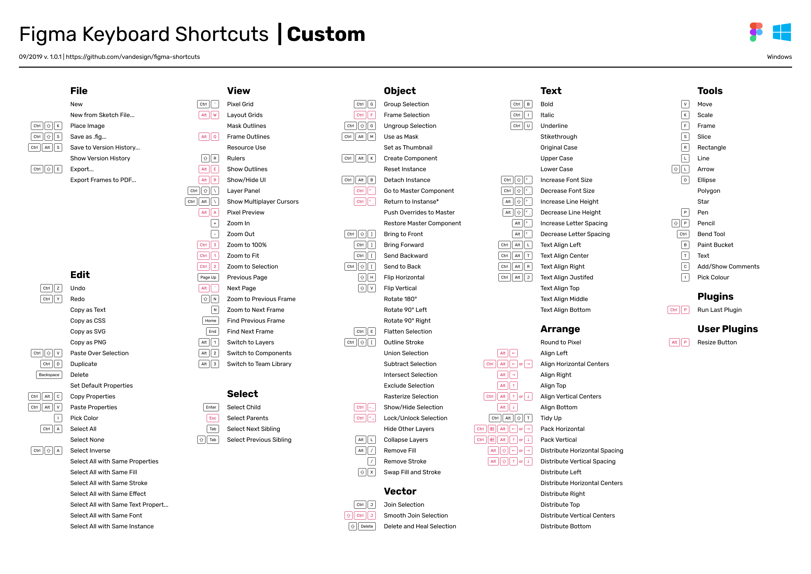

### ENG | [РУС](./README.md)

# Custom Shortcuts for Figma
Autohotkey 1.1.30 script for add Custom Shortcuts to Figma (Win).

## Install
- [Download](https://www.autohotkey.com/) and install Autohotkey 1.1.3 (Current Version).
- Download `figma-autohotkey` folder from this repo.
- Run `my-script.ahk` script.
- To run the script automatically create a shortcut to `my-script.ahk` file and place it in `%AppData%\Microsoft\Windows\Start Menu\Programs\Startup`

## Shortcuts

## Setup
Ссылка на видео.

## Figma template
Figma template with the shortcuts is available in
[vandesign/figma-shortcuts](https://github.com/vandesign/figma-shortcuts#figma)
repository.
